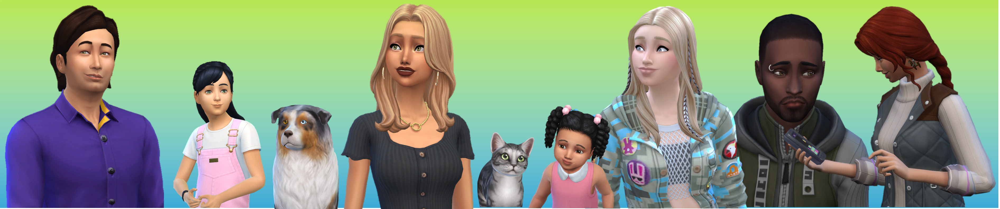

# 100 Days Of Code - Log

### Day 0: March 6, 2022

**Today's Progress**: Planned for the journey ahead

**Thoughts:** I think doing the CodeCademy course from the start and working on the Portfolio website is a good start. The Sims Tracker will be a bit of a left field thing to work on but I think I can work with a number of technologies of it and maybe some other plays find it useful in the end. I also need to have another look at my portfoliosite to se what I want to hange and to add the missing responsiveness.

So essentially there will be 3 work streams:

1. CodeCademy Full Stack Path
2. Update and improve portfolio website
3. Create Sims Tracker
4. blog for direct practice documenting the journey

**Link to work:** [Portfolio](http://www.susannebrauer.github.io)

### Day 1: March 7, 2022

**Plan For Today**:

- ~~Finish HTML FUndamentals Chapter on the CodeCademy course~~
- ~~Layout Simstracker landing page (logged in/logged out?)~~
- Layout Sims Household summary page for Simtracker
- Layout single Sims summary page for Simstracker
- ~~setup HTML for blog summary page (blog maybe about this journey and gamesfor the moment it'll be mostly for practice at this point)~~
  _going to add the blog to work streams in Day 0 list_

**Today's Progress**: Studying, layouting and my little blog

**Thoughts:** I have completed the HTML chapter of my course, I really like the idea of the semantic tags. I have then used the HTML to start writing this little blog using those skills as my practice for the day. I will add a link to the blog to the work links below.  
My project, which will be a website to track details for Sims in The Sims 4™, still needs some layout work before I can dive into writing actual code for it so the coding for that will be part of the challenge later. I did some first laytou work on the project but as much as I was hoping to do as I was spend more time working through the course and writing this blog which in way felt more important in the scope of the challenge.

**Link to work:** [Portfolio](http://www.susannebrauer.github.io), [Blog](http://www.susannebrauer.com)

### Day 2: March 8, 2022

**Plan For Today**:

- ~~Finish CSS Fundamentals Chapter on the CodeCademy Course~~
- ~~add CSS to the Blog~~
- ~~start coding HTML for Sims tracker landing page~~
- Layout Sims Household summary page for Simtracker
- Layout single Sims summary page for Simstracker

**Today's Progress**: Styling galore and setting up the Sims Tracker project also set up git for my work

**Thoughts:** The day got away from me a little so it was late night, but I managed to get through my Fundamentals of CSS chapter as planned. And put some first CSS on my blog and it is starting to look a little nicer.
In the CSS chapter there were quite a few things I was familiar with from some previous studying, but there were also some new things. Fro example the sticky positioning option was new to me. I also finally got a better understanding of positioning and of the clear property which was a bit of mystery to me before.  
I also finally set git up properly to track my work on the projects, but that is part of what was eating some of my time.  
For the Sims Tracker it got late to get on with the layout and to do some proper work on the landing page, so I just setup the webspace and wrote a little placeholder with some HTML and CSS.  
So I didn't get all my tasks done but I'm still happy with what did get done ine the end.

**Link to work:** [Portfolio](http://www.susannebrauer.github.io), [Blog](http://www.susannebrauer.com), [Sims Tracker](http://www.http://simstracker.com/)

### Day 3: March 9, 2022

**Plan For Today**:

- ~~Course work on local developing and website deployment~~
- ~~HTML/CSS for Sims tracker landing page~~
- Layout Sims Household summary page for Simtracker
- Layout single Sims summary page for Simstracker
- further style improvement on Blog

**Today's Progress**: First "free"(or local) Codecademy project and proper start on Sims Tracker project.

**Thoughts:** I have done the chapters on my course that I planned to do, but they were mostly things I was already aware of, but in the end there was a little project in create a website as per a give example and specs which was a nice exercise and I will link the result in the link here.  
I have done more work on the Sims Tracker landing page and but I will leave the place holder page in place  at the domain until some actual functionality is in place there. So if you want to follow along with the progress I will post updates and pictures here or you can follow along on my github account. So this what hte landing page looks like now. The little banner oin the header is not ideal just yet but I did not want to spend a ton of time on the picture and get to working on the code.The next step putting a sign up form below then this piece will be done in its static form and I can move on to the next part.
  
Yes I said a sign up form and yes there is a login button at the top right there. I think the actual functionality for those is still realatively far in the future, but I do want this to be something people can actually use so it'll need some kind of account system and database behind it. While this is somewhat intimidating at this point in time, learning how to make that work is something I really look forward to and part of why I chose this project.  
So Overall I would have liked to get a bit more work done on sprucing up this blog, but sometimes the days are just not long enough. SO I didn't get everything done but I'm happy with the things I did get done.  
  
**Link to work:** [Portfolio](http://www.susannebrauer.github.io), [Blog](http://www.susannebrauer.com), [Sims Tracker](http://www.http://simstracker.com/), [CodeCademy Project Dasmoto](http://www.susannebrauer.com/CodeCademyProject-Dasmoto/)  
  
**Course Completion Status at the end of the day:** 8%